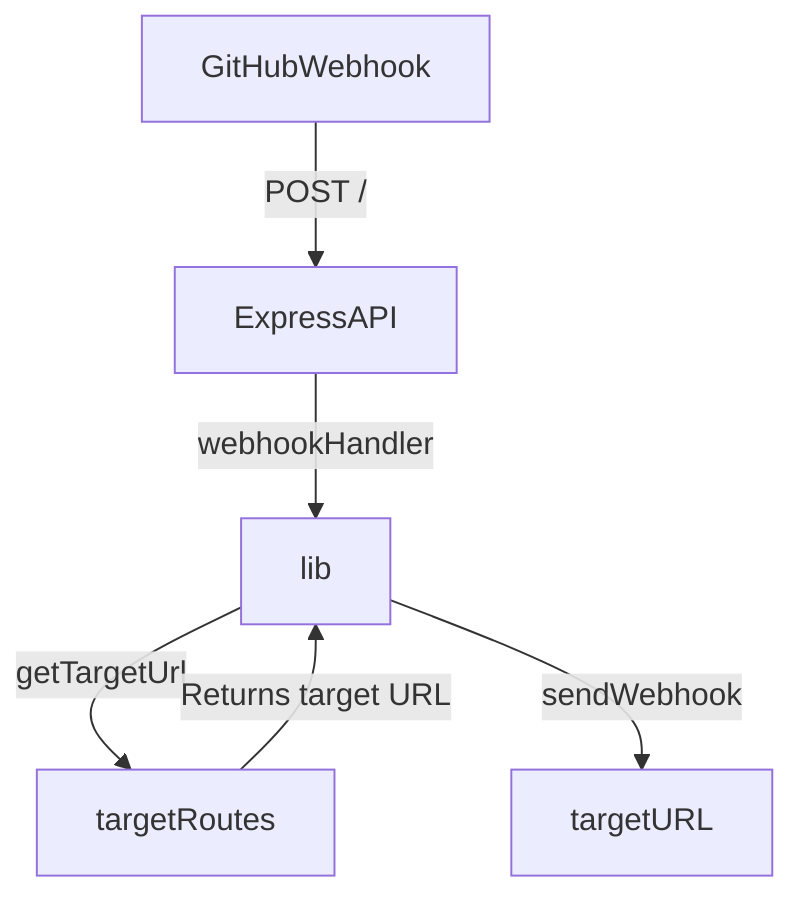

# GitHub Webhook Dispatcher

A centralized API service for consuming [GitHub webhook events](https://docs.github.com/en/webhooks/about-webhooks) and routing them to downstream service endpoints based on configurable rules.

## Overview



This application acts as a webhook dispatcher that:

1. Receives GitHub webhook events at a centralized endpoint
2. Validates webhook signatures for security
3. Routes events to appropriate downstream services based on repository configuration
4. Provides reliable webhook forwarding with proper error handling

## Prerequisites

- **Node.js**: Version 20.0.0 or higher
- **npm**: Version 8.0.0 or higher
- A GitHub repository with webhook configuration
- Target services to receive forwarded webhooks

## Quick Start

1. **Clone and install dependencies:**

   ```sh
   git clone https://github.com/collinmcneese/github-webhook-dispatcher.git
   cd github-webhook-dispatcher
   npm install
   ```

2. **Set required environment variables:**

   ```sh
   export WEBHOOK_DISPATCHER_WEBHOOK_SECRET=your_github_webhook_secret
   export WEBHOOK_DISPATCHER_ROUTE_FILE=./routes.toml
   ```

3. **Create a routes configuration file** (see [example](./routes.toml)):

   ```toml
   [your-org]
   target = "https://your-service.example.com/webhook"
   ```

4. **Start the application:**

   ```sh
   npm run dev
   ```

5. **Configure your GitHub webhook** to point to `http://your-server:3000/`

## Application Components

- [src/app.js](./src/app.js): The main Express application file. This file contains the Express API server and webhook handler.
- [src/lib.js](./src/lib.js): The main library file. This file contains the webhook handler and functions for retrieving the target URL for a given GitHub repository.
- [src/config.js](./src/config.js): The main configuration file. This file contains the configuration for the Express API server and webhook handler.
- [openapi.yaml](./openapi.yaml): The OpenAPI specification file. This file contains the OpenAPI specification for the Express API server.

## Security Considerations

### Webhook Secret Validation

- **Always use a strong webhook secret**: Generate a cryptographically secure random string
- **Keep secrets secure**: Store the webhook secret in environment variables, never in code
- **Rotate secrets regularly**: Update webhook secrets periodically for better security

### Network Security

- **Use HTTPS in production**: Always deploy behind HTTPS to protect webhook payloads
- **Enable SSL verification**: GitHub recommends keeping SSL verification enabled (default)
- **IP allowlisting**: Restrict access to GitHub's webhook IP ranges using the `/meta` API endpoint
- **Rate limiting**: The application includes built-in rate limiting to prevent abuse
- **Response timing**: Responds within GitHub's 10-second timeout requirement

### Best Practices

This application follows [GitHub's webhook best practices](https://docs.github.com/en/webhooks/using-webhooks/best-practices-for-using-webhooks):

- **Use strong webhook secrets**: Generate cryptographically secure random strings
- **HTTPS in production**: Always deploy behind HTTPS with SSL verification enabled
- **IP allowlisting**: Restrict access to GitHub's webhook IP ranges (see `/meta` endpoint)
- **Quick response times**: Responds within GitHub's 10-second requirement
- **Event validation**: Validates event types and webhook signatures

### Performance and Reliability

- **Asynchronous processing**: Consider implementing a queue system for heavy processing
- **Event filtering**: Only subscribe to the webhook events you actually need
- **Replay protection**: Uses `X-GitHub-Delivery` headers to prevent replay attacks
- **Error handling**: Proper error responses and logging for failed deliveries

```sh
# Generate a secure webhook secret (macOS/Linux)
openssl rand -hex 32

# Use environment files for local development
echo "WEBHOOK_DISPATCHER_WEBHOOK_SECRET=$(openssl rand -hex 32)" > .env
```

## Troubleshooting

### Common Issues

**Problem**: `Error: WEBHOOK_DISPATCHER_WEBHOOK_SECRET is required`
**Solution**: Ensure the webhook secret environment variable is set before starting the application.

**Problem**: `Error: Cannot read routes file`
**Solution**: Verify the routes file path and ensure the file exists and is readable.

**Problem**: `Error: Invalid webhook signature`
**Solution**: Check that the webhook secret matches between GitHub webhook settings and your environment variable.

**Problem**: Webhooks not being forwarded
**Solution**: Verify your routes configuration matches your GitHub repository owner/name exactly (case-sensitive).

### Debug Mode

Enable debug logging by setting the environment variable:

```sh
export DEBUG=webhook-dispatcher:*
npm run dev
```

### Checking Application Health

The application exposes a health check endpoint:

```sh
curl http://localhost:3000/health
```

## Environment Variables

The following environment variables configure the application:

> [!WARNING]
> Breaking change in version 3.0.0: The environment variable names have been updated to use the prefix `WEBHOOK_DISPATCHER_` instead of `WHDISPATCHER_`.

| Variable | Required | Default | Description |
|----------|----------|---------|-------------|
| `WEBHOOK_DISPATCHER_PORT` | No | `3000` | The port number for the Express API server |
| `WEBHOOK_DISPATCHER_WEBHOOK_SECRET` | **Yes** | - | Secret token to verify GitHub webhook events. Must match GitHub repository webhook settings |
| `WEBHOOK_DISPATCHER_ROUTE_FILE` | **Yes** | - | Path to the routes configuration file (TOML, JSON, or YAML format) |

### Environment Variables Example

```sh
export WEBHOOK_DISPATCHER_PORT=8080
export WEBHOOK_DISPATCHER_WEBHOOK_SECRET=abc123
export WEBHOOK_DISPATCHER_ROUTE_FILE=/path/to/routes.toml
```

## Target Routes Configuration

The routes configuration file maps GitHub repository owners and names to target URLs where webhooks should be forwarded.

### Supported Formats

The application supports TOML (recommended), JSON, and YAML formats for the routes file.

### Configuration Structure

- **Top-level objects**: GitHub repository owners or organizations
- **Owner-level target**: Default URL for all repositories under an owner/organization
- **Repository-level targets**: Specific URLs for individual repositories (overrides owner-level target)
- **Event filtering**: Optional `events` array to specify which GitHub webhook event types to forward

#### Event Filtering

You can optionally specify which GitHub webhook event types should be forwarded by adding an `events` array to your route configuration. If no `events` array is specified, all webhook events will be forwarded (default behavior).

Common GitHub webhook event types include:

- `push` - Repository push events
- `pull_request` - Pull request events (opened, closed, etc.)
- `issues` - Issue events (opened, closed, etc.)
- `issue_comment` - Comments on issues or pull requests
- `release` - Release events
- `workflow_run` - GitHub Actions workflow events
- `star` - Repository starring events
- `fork` - Repository fork events

For a complete list of available event types, see the [GitHub webhook documentation](https://docs.github.com/en/webhooks/webhook-events-and-payloads).

### Configuration Examples

<details>
<summary><strong>TOML Example</strong></summary>

```toml
# Top level objects are GitHub repository owners or organizations
[owner1]
  # Default target URL for all repositories owned by owner1
  target = "https://example.com/owner1"
  # Only forward push and pull_request events for this org
  events = ["push", "pull_request", "issues"]

  # Specific target for owner1/repo1
  [owner1.repo1]
    target = "https://example.com/owner1/repo1"
    # Only forward specific events for this repo
    events = ["push", "release", "workflow_run"]

  # Specific target for owner1/repo2
  [owner1.repo2]
    target = "https://example.com/owner1/repo2"
    # Forward all events (events array not specified)

[owner2]
  # Only specific repository targets, no default
  [owner2.special-repo]
    target = "https://special-service.example.com/webhook"
    # Only forward star and fork events
    events = ["star", "fork"]
```

</details>

<details>
<summary><strong>JSON Example</strong></summary>

```json
{
  "owner1": {
    "target": "https://example.com/owner1",
    "events": ["push", "pull_request", "issues"],
    "repo1": {
      "target": "https://example.com/owner1/repo1",
      "events": ["push", "release", "workflow_run"]
    },
    "repo2": {
      "target": "https://example.com/owner1/repo2"
    }
  },
  "owner2": {
    "special-repo": {
      "target": "https://special-service.example.com/webhook",
      "events": ["star", "fork"]
    }
  }
}
```

</details>

<details>
<summary><strong>YAML Example</strong></summary>

```yaml
owner1:
  target: https://example.com/owner1
  events: ["push", "pull_request", "issues"]
  repo1:
    target: https://example.com/owner1/repo1
    events: ["push", "release", "workflow_run"]
  repo2:
    target: https://example.com/owner1/repo2

owner2:
  special-repo:
    target: https://special-service.example.com/webhook
    events: ["star", "fork"]
```

</details>

## Running the Application

### Development Mode

For local development with automatic restart on file changes:

```sh
npm install  # if not already done
npm run dev
```

### Production Mode

For production deployment:

```sh
npm install --production
npm run build
npm start
```

### Docker

Build and run the application in a Docker container:

```sh
# Build the Docker image
docker build -t webhook-dispatcher .

# Run with environment variables
docker run \
  -p 3000:3000 \
  -e WEBHOOK_DISPATCHER_WEBHOOK_SECRET=your_secret_here \
  -e WEBHOOK_DISPATCHER_ROUTE_FILE=/app/routes.toml \
  -v $(pwd)/routes.toml:/app/routes.toml:ro \
  webhook-dispatcher
```

### Docker Compose

Create a `docker-compose.yml` file for easier management:

```yaml
version: '3.8'
services:
  webhook-dispatcher:
    build: .
    ports:
      - "3000:3000"
    environment:
      - WEBHOOK_DISPATCHER_WEBHOOK_SECRET=your_secret_here
      - WEBHOOK_DISPATCHER_ROUTE_FILE=/app/routes.toml
    volumes:
      - ./routes.toml:/app/routes.toml:ro
    restart: unless-stopped
```

Then run with:

```sh
docker-compose up -d
```

## TODOs

- [x] ~~Write out full docs for README~~ ✅ Completed
- [ ] Add queueing mechanism for asynchronous processing (GitHub best practice)
- [ ] Add ability to poll GitHub and find failed event notifications for retransmission
- [x] ~~Implement webhook event filtering based on event types~~ ✅ Completed
- [ ] Add replay attack protection using `X-GitHub-Delivery` headers
- [ ] Add option to read routes from an alternate source instead of local file
- [ ] Add cloud-native infrastructure setup for all components for Azure and AWS
- [ ] Add comprehensive test suite
- [ ] Add metrics and monitoring endpoints
