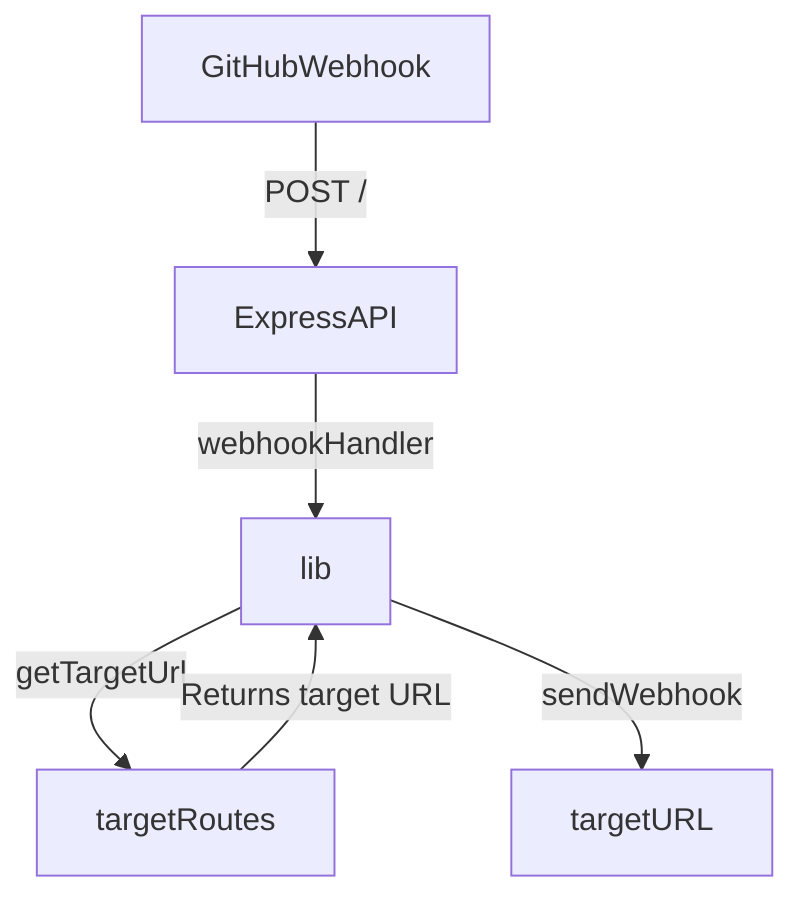

# GitHub Webhook Dispatcher

Example repository for consuming [GitHub webhook events](https://docs.github.com/en/developers/webhooks-and-events/webhooks/about-webhooks) in a centralized API which can then handle routing webhooks to downstream service endpoints.



## Application Components

- [src/app.js](./src/app.js): The main Express application file. This file contains the Express API server and webhook handler.
- [src/lib.js](./src/lib.js): The main library file. This file contains the webhook handler and functions for retrieving the target URL for a given GitHub repository.
- [src/config.js](./src/config.js): The main configuration file. This file contains the configuration for the Express API server and webhook handler.
- [src/openapi.yaml](./src/openapi.yaml): The OpenAPI specification file. This file contains the OpenAPI specification for the Express API server.

## Usage

## Environment Variables

The following ENV variables are expected to be set in order for the application to function properly:

- `WEBHOOK_DISPATCHER_PORT`: The port number that the Express API server should listen on. Defaults to 3000 if not set.
- `WEBHOOK_DISPATCHER_WEBHOOK_SECRET`: The secret token used to verify incoming GitHub webhook events. This should match the secret token configured in the GitHub repository webhook settings.
- `WEBHOOK_DISPATCHER_ROUTE_FILE`: The path to the file containing the targetRoutes object used to map incoming GitHub webhook events to downstream services. This should be a nested object that maps GitHub repository owners and names to target URLs. See the [Target Routes File](#target-routes-file) documentation for more information.

### Example

In this example, the application will listen on port 8080, use the GitHub secret token `abc123` to verify incoming webhook events, and use the `targetRoutes` object in the file /path/to/routes.toml to route incoming webhook events to the appropriate downstream services.

```sh
export WEBHOOK_DISPATCHER_PORT=8080
export WEBHOOK_DISPATCHER_WEBHOOK_SECRET=abc123
export WEBHOOK_DISPATCHER_ROUTE_FILE=/path/to/routes.toml
```

## Running the Application

### Locally

To run the application locally, first install the dependencies:

```sh
npm install
```

Then, start the application:

```sh
npm start
```

### Local Development

To run the application locally in development mode, first install the dependencies:

```sh
npm install
```

Then, start the application in development mode:

```sh
npm run dev
```

### Docker

To run the application in a Docker container, first build the Docker image:

```sh
docker build -t webhook-dispatcher .
```

Then, run the Docker container, passing required environment variables:

```sh
docker run \
  -p 3000:3000 \
  -e WEBHOOK_DISPATCHER_PORT=3000 \
  -e WEBHOOK_DISPATCHER_WEBHOOK_SECRET=abc123 \
  -e WEBHOOK_DISPATCHER_ROUTE_FILE=/path/to/routes.toml \
  webhook-dispatcher
```

## Target Routes

### Target Routes File

The targetRoutes object is a nested object that maps GitHub repository owners and names to target URLs. The object should be structured as follows:

<details>
<summary>TOML Example</summary>

```toml
# Top level objects are GitHub repository owners or organizations
[owner1]
  # Top level objects can contain a default target URL for all repositories owned by the owner or organization
  target = "https://example.com/owner1"
  # Second level objects are GitHub repository names and contain a target URL for the specific repository
  [owner1.repo1]
    target = "https://example.com/owner1/repo1"
  [owner1.repo2]
    target = "https://example.com/owner1repo2"
```

</details>

<details>
<summary>JSON Example</summary>

```json
{
  "owner1": {
    "target": "https://example.com/owner1",
    "repo1": {
      "target": "https://example.com/owner1/repo1"
    },
    "repo2": {
      "target": "https://example.com/owner1/repo2"
    }
  }
}
```

</details>

<details>
<summary>YAML Example</summary>

```yaml
owner1:
  target: https://example.com/owner1
  repo1:
    target: https://example.com/owner1/repo1
  repo2:
    target: https://example.com/owner1/repo2
```

</details>

## TODOs

- [ ] Write out full docs for README
- [ ] Add queueing mechanism
- [ ] Add ability to poll GitHub and find failed event notifications for retransmission
- [ ] Add option to read routes from an alternate source instead of local TOML file
- [ ] Add cloud-native infrastructure setup for all components for Azure and AWS
