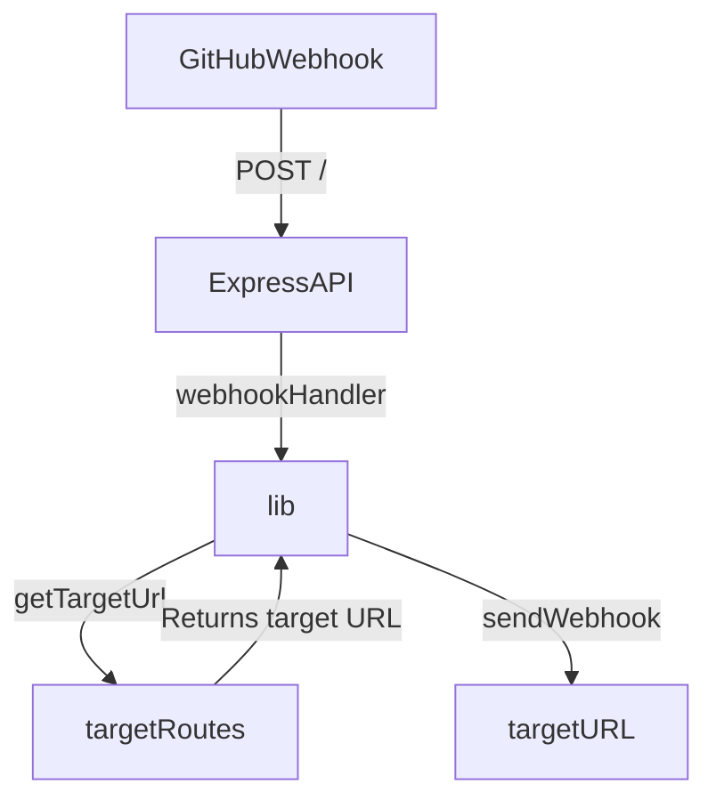

# GitHub Webhook Dispatcher

Example repository for consuming [GitHub webhook events](https://docs.github.com/en/developers/webhooks-and-events/webhooks/about-webhooks) in a centralized API which can then handle routing webhooks to downstream service endpoints.



## Usage

## Environment Variables

The following ENV variables are expected to be set in order for the application to function properly:

- WHDISPATCHER_PORT: The port number that the Express API server should listen on. Defaults to 3000 if not set.
- WHDISPATCHER_WEBHOOK_SECRET: The secret token used to verify incoming GitHub webhook events. This should match the secret token configured in the GitHub repository webhook settings.
- WHDISPATCHER_ROUTE_FILE: The path to the file containing the targetRoutes object used to map incoming GitHub webhook events to downstream services. This should be a nested object that maps GitHub repository owners and names to target URLs. See the targetRoutes documentation for more information.

### Example

In this example, the application will listen on port 8080, use the GitHub secret token `abc123` to verify incoming webhook events, and use the `targetRoutes` object in the file /path/to/routes.toml to route incoming webhook events to the appropriate downstream services.

```sh
export WHDISPATCHER_PORT=8080
export WHDISPATCHER_WEBHOOK_SECRET=abc123
export WHDISPATCHER_ROUTE_FILE=/path/to/routes.toml
```

## TODOs

- [ ] Write out full docs for README
- [ ] Add queueing mechanism
- [ ] Add ability to poll GitHub and find failed event notifications for retransmission
- [ ] Add option to read routes from an alternate source instead of local TOML file
- [ ] Add cloud-native infrastructure setup for all components for Azure and AWS
